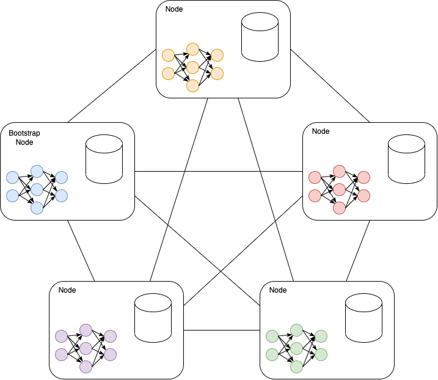
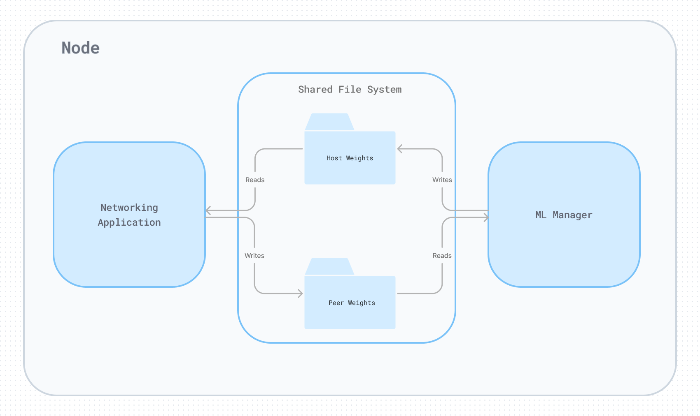
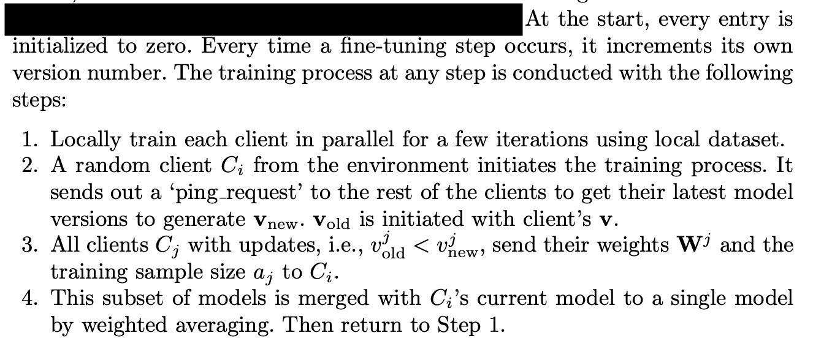
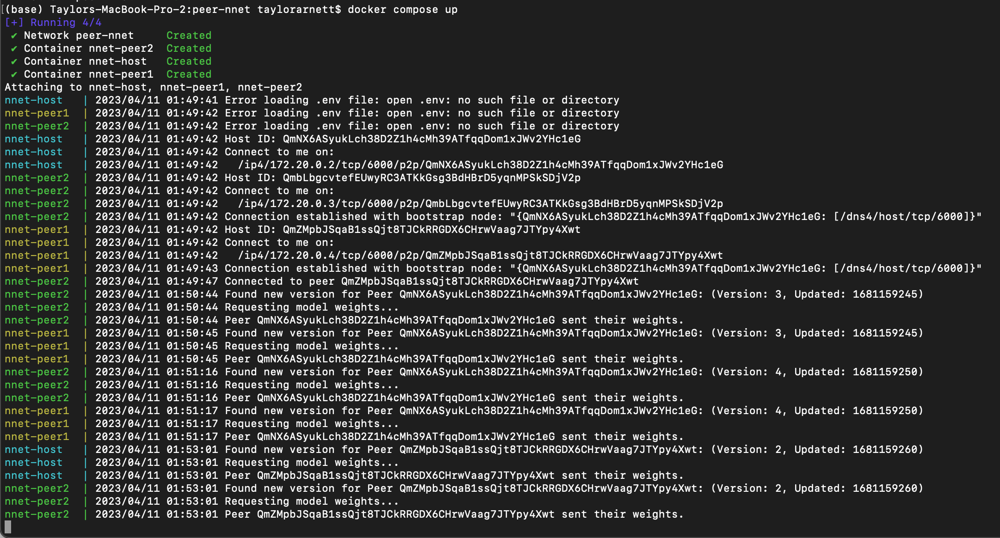

# peer-nnet

A lightweight peer-to-peer application to train a distributed neural network via federated learning.

The implementation is inspired by [BrainTorrent][].

## Why distributed?

Access to sufficient training data to create performant neural networks is challenging within industries with strict privacy requirements. One such example is the medical industry. An individual medical center likely lacks sufficient data to train a model with acceptable performance metrics. However, several medical centers could share their data to form one shared model. In practice, sensitive medical data can't be shared very easily. Federated learning allows various centers to collaborate and construct shared models without compromising sensitive data. By sharing high-level model metadata and learned weights, each node in the network can benefit from the training of other models in the network.

## Why p2p?

Typical federated learning approaches depend on a central server that all nodes must trust. By leveraging peer-to-peer technologies, nodes in the network can communicate with each other directly, eliminating the need for a central authority.

## Architecture overview

The network is composed of nodes communicating to one another over TCP.



Each node has its own neural network training process and peer-nnet golang process to handle the networking and state updates between nodes.



Each client maintains its ledger of connected peers and each peer's last model version used during merging. Each node will store the latest version of its connected peers' model weights on disk to share with the neural net training process.

The training algorithm used is directly copied from the [BrainTorrent][] paper:



## To run

The easiest way to run the network with multiple peers is to use the docker compose configuration. This will create a network of three nodes.

```bash
docker compose up
```




## Coming soon

- Enable automatic peer discovery using a rendevous point
- [Collect peer churn data](https://github.com/willscott/ipfs-counter/blob/willscott/churn/main.go) to inform remediation approaches
- ...

[braintorrent]: https://arxiv.org/pdf/1905.06731.pdf
